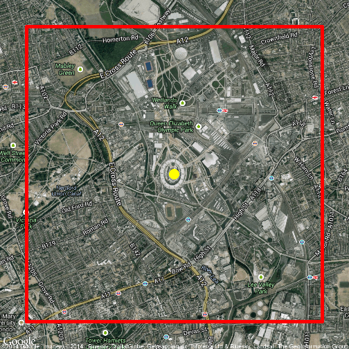

mapit
====

[](https://travis-ci.org/trinker/mapit)

mapit is an R package designed to assist in mapping tasks.  Its prominent tool is the wrapper for the [Texas A & M Geoservices](geoservices.tamu.ed) that provides R based geocoding.  Users can sign up for an API key [HERE](https://geoservices.tamu.edu/Signup/).

## Installation

To download the development version of qdap:

Download the [zip ball](https://github.com/trinker/mapit/zipball/master) or [tar ball](https://github.com/trinker/mapit/tarball/master), decompress and run `R CMD INSTALL` on it, or use the **devtools** package to install the development version:


```r
# install.packages("devtools")

library(devtools)
install_github("mapit", "trinker")
```

**Note**: Windows users need [Rtools](http://www.murdoch-sutherland.com/Rtools/) and [devtools](http://CRAN.R-project.org/package=devtools) to install this way.

**Note**: Mac users might be required to install the appropriate version [XTools](https://developer.apple.com/xcode/) from the [Apple Developer site](https://developer.apple.com/) in order to install the development version.  You may need to [register as an Apple developer](https://developer.apple.com/programs/register/).  An older version of XTools may also be required.

## Contact

You are welcome to:
* submit suggestions and bug-reports at: https://github.com/trinker/mapit/issues
* send a pull request on: https://github.com/trinker/mapit/
* compose a friendly e-mail to: tyler.rinker@gmail.com

---

# bounding_box Function

This is an R implementation of Jan Philip Matuschek's bounding box article: [*Finding Points Within a Distance of a Latitude/Longitude Using Bounding Coordinates*](http://janmatuschek.de/LatitudeLongitudeBoundingCoordinates).


So here we can look at the area within one square mile of the White House:


```r
bounding_box(38.89768, -77.03653, 1)
```

```
##        min    max
## lng -77.06 -77.02
## lat  38.88  38.91
```

Let's apply it.  Here's an example plotting a bounding box around the 2012 Olympic Stadium:


```r
library(ggplot2); library(ggmap)

bb <- bounding_box(lon = -0.016179, lat = 51.538525, 1)

mapImageData <- get_map(location = c(lon = -0.016179, lat = 51.538525),
    color = "color",
    source = "google",
    maptype = "hybrid",
    zoom = 14)
 
ggmap(mapImageData,
    extent = "device",
    ylab = "Latitude",
    xlab = "Longitude") + 
	geom_rect(aes(xmin = bb[1, 1], xmax = bb[1, 2], ymin = bb[2, 1], 
 		ymax = bb[2, 2]), color="red", fill=NA, size=2) +
	geom_point(data=data.frame(lon = -0.016179, lat = 51.538525), size=7, 
		color="yellow")
```

 
